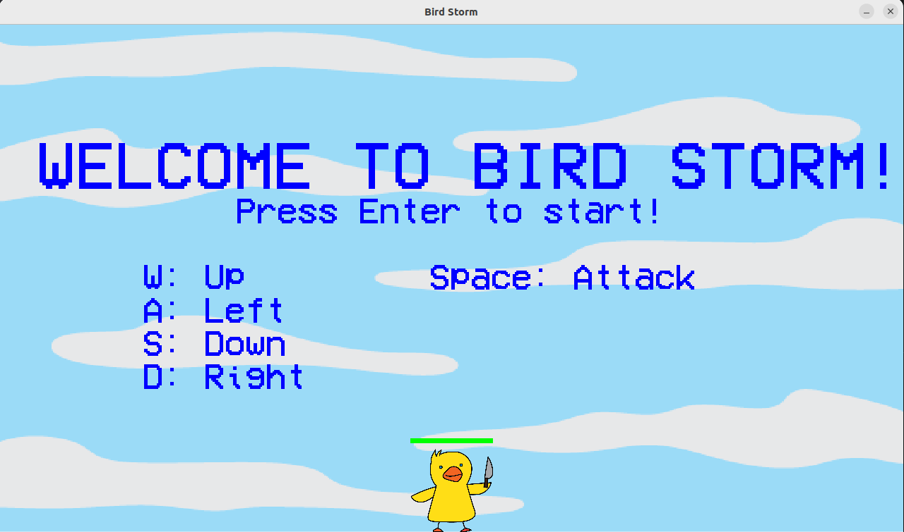

# Fight or Flight: *Bird Storm*
*A bird-themed hack-and-slash game where the player fights progressively more powerful minions until they encounter the final boss.*



### Getting Started
All of the required packages are listed in `requirements.txt`. Running the command below will download all packages necessary to run *Bird Storm*:
```
pip install -r requirements.txt
```

### Folder Structure
`Animations/`: holds all .png images of character, attack, and environment sprites.\
`fonts/`: holds the .ttf for the font used in the game text\
`images/`: holds screenshots of the game used for documentation\
`docs/`: hold all files for the GitHub Pages website associated with *Bird Storm*, linked at [olincollege.github.io/Bird-Storm](https://olincollege.github.io/Bird-Storm).

### Unit Tests
Unit tests are available through using pytest in files starting with `test_`. Running the command below will run all unit tests.
```
python -m pytest
```

### Game Controls
W: Move up\
A: Move to the left\
S: Move down\
D: Move to the right\
Space Bar: Attack

### Play the Game
The main game loop is stored in the file `main.py`. Running the command below in the terminal will start the game:
```
python main.py
```
Have fun!


